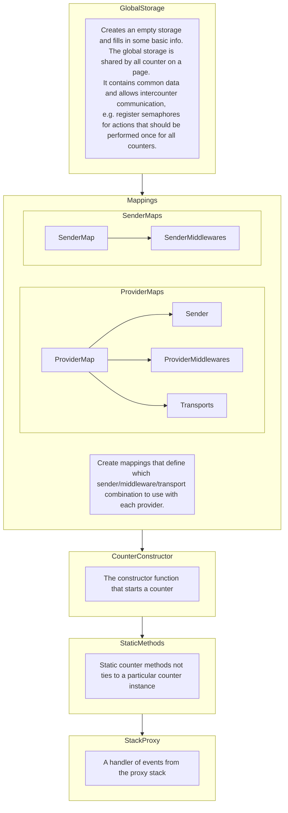
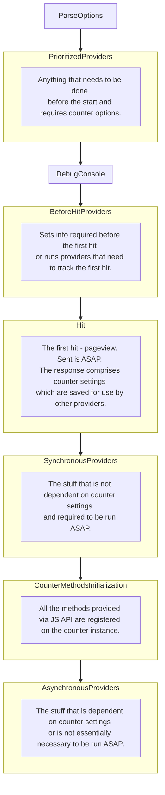
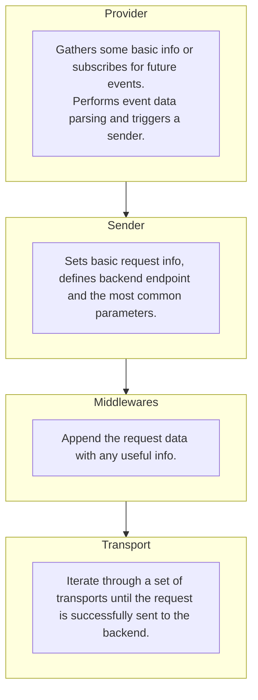

Flow chart of the counter

# Initialization
The code is run automatically when the script is parsed. This step defines common code used by all counters on the page.

# Constructor
The code run is triggered by a user: either calling the constructor (`new Ya.Metrika2(XXXXXX)`) or via proxy stack (`ym(XXXXXX, "init", {});`).

# Request flow
Any request provider performs some initial actions:
- gathers data from page and browser;
- subscribes for user or DOM events;
- prepares data for further processing by a sender/middlewares.

Then a sender is called.

